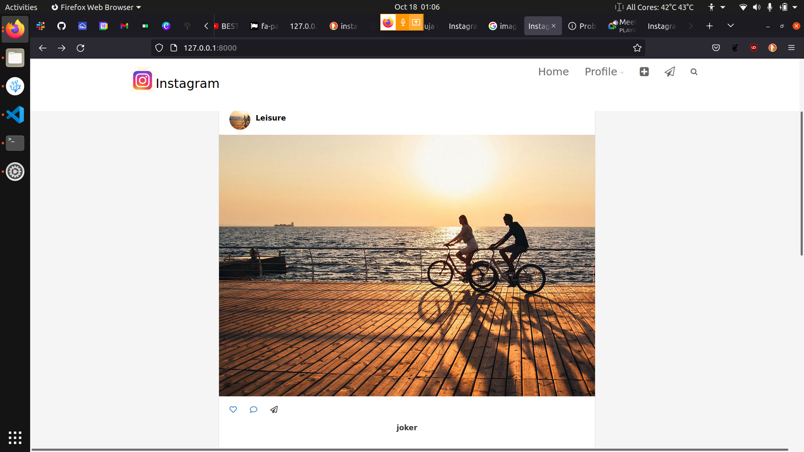

# Instagram

* This Instagram app  created as a clone of instagram.Developed during Moringa Core. 

# AUTHOR
* By: Nyagah Isaac

# Description

* This web-app allows a user to create a Profile, add Post and allow users add comment that are all under his username allowing other users to vote for them.
# Setup/Installation Requirements

    Live site can be accessed from the following link[]
   
# The App
 
 

## Prerequisites

    python3.8
    pip
    virtualenv
    Requirements.txt

# Cloning
* In your terminal:

  * $ git clone https://github.com/Nyagahisaac/instagram.git.
  * $ cd Instagram

## Running the Application
Creating the virtual environment

    $ python3.8 -m venv virtual
    $ source virtual/bin/env

## Installing Django and other Modules

    $ see Requirements.txt

## To run the application, in your terminal:

    $ python3.8 manage.py runserver

## Testing the Application
### To run the tests for the class files:

    $ python3.8 manage.py test

## Technologies Used
This project was generated with :~

    Python version 3.8.0.
    Django
    Bootstrap.
    Javascript.
    PSQL database.
    HTML,CSS

# Known Bugs
## Support and contact details

 Incase of a problem, issue or need more clarification, feel free to send an email : [ nyagahisaac@gmail.com ]
## About

 This is an application that enables users to views pictures as well as post , comments to thier favourite pictures. The user can also view images according thier profile and like the picture.

   

    Resources

    Readme

    Releases

    No releases published

    Packages

    No packages published

   ## Languages

    Python 93.5%

    JavaScript 3.9%

    HTML 1.7%

    Other 0.9%

# Copyright
 ## @isaac 2021
